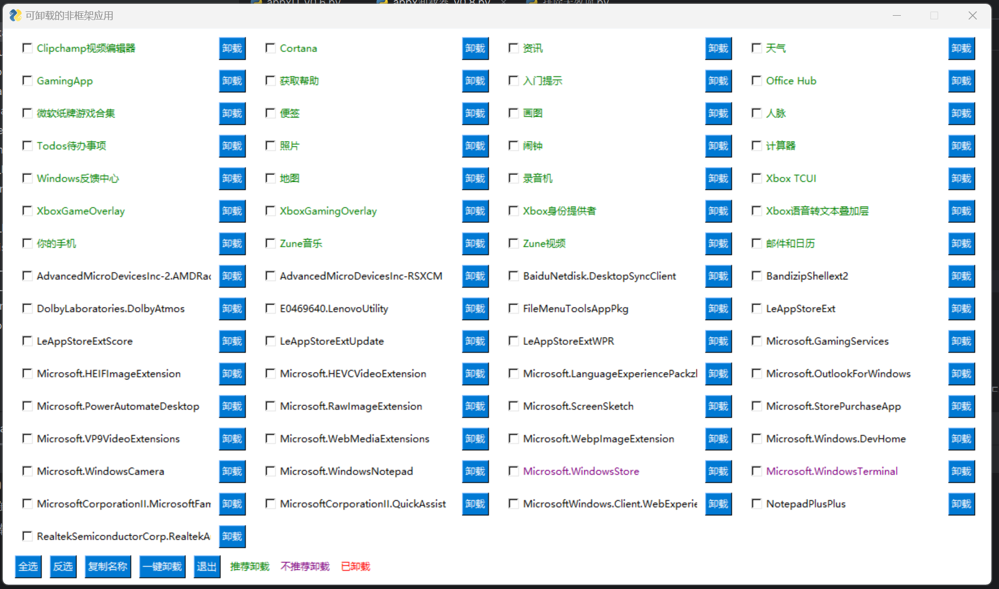

# WinAppsUninstaller

#### 介绍
本代码实现了一个简单的 Python 程序，用于卸载 Windows 10/11 系统中的预装应用。通过调用 PowerShell 命令获取系统中可卸载的非框架应用，并将它们以多选框的形式展示在 PySimpleGUI 窗口中。用户可以选择需要卸载的应用，然后点击“一键卸载”按钮进行卸载操作。

#### 软件架构
该程序主要由以下几个部分组成：

- 引入subprocess用于发起powershell命令
- 引入PySimpleGUI用于绘制界面
- 引入pyperclip用于复制应用名到系统剪贴板
- uninstall_selected_apps 函数：负责执行卸载操作，根据用户选择的应用名列表，生成并运行相应的 PowerShell 命令。
- notfoundAppx 函数：检查指定的应用是否不存在，返回 True 或 False。
- getColor 函数：根据应用名返回文本颜色，推荐卸载的应用为绿色，不推荐卸载的应用为紫色，其他应用为黑色。
- getName 函数：根据应用名返回显示名称，如果应用在推荐列表中，则返回推荐列表中的名称，否则返回原始名称。
- tidy 函数：对应用列表进行排序，推荐列表中的应用置顶。
- create_layout 函数：创建 PySimpleGUI 窗口布局。
- 全局变量 recom_dict 和 warn_list：分别存储`推荐卸载的应用`和`不推荐卸载的应用`。

#### 安装教程

安装 Python：请访问 https://www.python.org/downloads/ 下载并安装 Python。
安装 PySimpleGUI：在命令行中输入以下命令进行安装： 
`pip install PySimpleGUI`
运行.py文件

#### 使用说明

在弹出的窗口中，点击应用后的卸载按钮，或选择需要卸载的应用，然后点击“一键卸载”按钮进行卸载操作。

#### 参与贡献

1.  Fork 本仓库
2.  新建 Feat_xxx 分支
3.  提交代码
4.  新建 Pull Request

#### 特点

- 使用 PowerShell 命令获取系统中的应用信息，避免手动查找和输入。
- 使用 PySimpleGUI 创建图形用户界面，使操作更加直观易用。
- 将推荐卸载的应用置顶，方便用户选择。
- 根据应用名返回文本颜色，以区分推荐卸载的应用和其他应用。
- 提供全选、反选和复制名称功能，方便用户操作。
- 读取包类型筛选可卸载、非框架应用
- 字典存储信息，获取信息更全面，代码更精简

